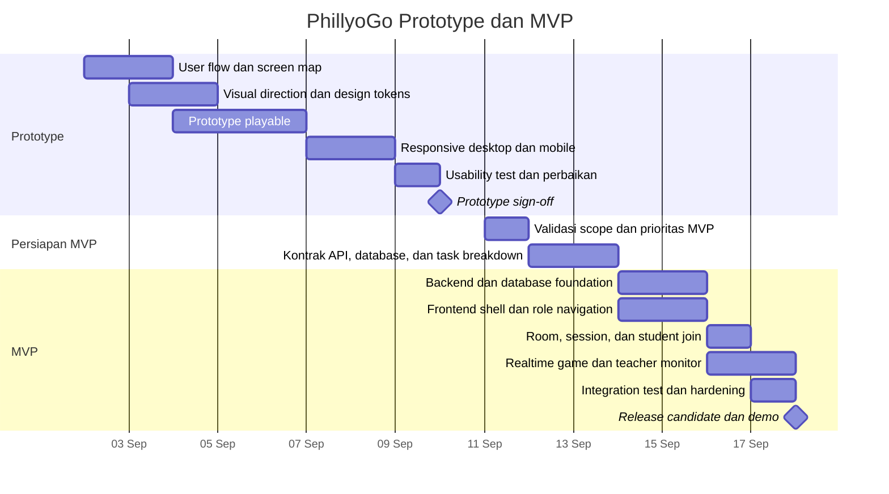

# PhillyoGo - Gantt Task List

Dokumen ini menjadi acuan pembagian tugas pengembangan PhillyoGo berdasarkan dua fase:

- **Prototype:** 2-10 September
- **MVP:** 14-18 September

> Catatan: tahun tidak dicantumkan pada tampilan jadwal agar dokumen tetap dapat digunakan kembali. Diagram Mermaid menggunakan **2026** sebagai contoh tahun sesuai konteks proyek saat ini dan dapat diganti bila diperlukan.

## 1. Ruang Lingkup

### Prototype

Prototype adalah validasi konsep dan pengalaman bermain berdasarkan [reference/index.html](reference/index.html). Fokusnya adalah memastikan bentuk permainan, alur layar, gaya visual, dan interaksi utama dapat dipahami sebelum dihubungkan ke sistem nyata.

Ruang lingkup prototype:

- Halaman pembuka dan identitas visual PhillyoGo.
- Alur masuk atau bergabung ke permainan.
- Pengisian nama dan hal yang ingin dibagikan.
- Tampilan topik permainan.
- Tampilan kartu, kelompok, giliran, dan hasil permainan.
- Interaksi dasar seperti mulai, lanjut, jeda, dan selesai.
- Pengujian alur pada desktop dan mobile.

### MVP

MVP adalah implementasi produk yang dapat digunakan end-to-end dengan backend, frontend, database, autentikasi, dan realtime. Cakupannya mengikuti struktur repository saat ini dan alur pada [SUCCESSFUL_FLOW.md](SUCCESSFUL_FLOW.md).

Ruang lingkup MVP:

- Super Admin mengelola sekolah.
- Admin Sekolah mengelola kelas, guru, dan topik.
- Guru membuat room dan game session.
- Siswa bergabung menggunakan kode room.
- Input peserta dan masalah melalui mode siswa atau guru.
- Mode permainan kelompok dan semua siswa.
- Monitoring permainan secara realtime.
- Pause, resume, reveal card, complete turn, dan finish game.
- Riwayat permainan dan pemulihan sesi siswa.
- Validasi, error handling, keamanan akses, testing, deployment, dan dokumentasi.

## 2. Ringkasan Jadwal

| Fase | Tanggal | Tujuan | Output utama |
|---|---:|---|---|
| Prototype | 2-3 September | Menyamakan konsep dan menyusun alur layar | User flow, daftar layar, aturan interaksi |
| Prototype | 4-6 September | Membangun tampilan dan interaksi inti | Prototype playable |
| Prototype | 7-8 September | Menyempurnakan responsif dan alur | Prototype desktop/mobile |
| Prototype | 9 September | Uji coba dan perbaikan | Daftar temuan dan perbaikan prioritas |
| Prototype | 10 September | Finalisasi prototype | Prototype sign-off dan backlog MVP |
| Validasi | 11-13 September | Persiapan teknis menuju MVP | Prioritas MVP, kontrak API, dan pembagian tugas |
| MVP | 14-15 September | Integrasi fondasi sistem | Backend, database, autentikasi, dan halaman utama |
| MVP | 16 September | Mengaktifkan alur game | Room, game session, student flow, dan realtime |
| MVP | 17 September | Hardening dan pengujian | Role validation, error handling, dan test result |
| MVP | 18 September | Release candidate | Demo end-to-end, dokumentasi, dan keputusan rilis |

## 3. Gantt Chart

## 4. Task List Prototype

| ID | Tanggal | Task | Output / kriteria selesai | Dependensi |
|---|---:|---|---|---|
| P-01 | 2 Sep | Memetakan user flow dari prototype reference | Alur guru dan siswa terdokumentasi dari join sampai hasil | - |
| P-02 | 2 Sep | Menentukan daftar layar prototype | Screen map: landing, join, input, waiting, game, result | P-01 |
| P-03 | 3 Sep | Menentukan visual direction | Warna, tipografi, komponen kartu, status, dan layout disepakati | P-02 |
| P-04 | 3 Sep | Menentukan aturan interaksi game | Aturan kelompok, giliran, kartu, pause, resume, dan finish tertulis | P-01 |
| P-05 | 4 Sep | Membuat landing dan halaman join | Pengguna dapat memulai alur dan memasukkan kode room | P-02, P-03 |
| P-06 | 5 Sep | Membuat halaman input dan waiting | Pengguna dapat mengisi nama/masalah dan melihat topik serta status menunggu | P-05 |
| P-07 | 6 Sep | Membuat game board dan result screen | Alur permainan dapat dimainkan sampai selesai menggunakan data mock | P-04, P-06 |
| P-08 | 7 Sep | Menambahkan mode kelompok dan semua siswa | Perbedaan label kelompok dan tampilan mode dapat diverifikasi | P-07 |
| P-09 | 8 Sep | Menyesuaikan layout desktop dan mobile | Tidak ada overflow atau elemen utama yang bertumpuk pada viewport target | P-07 |
| P-10 | 9 Sep | Menjalankan usability test | Temuan dicatat berdasarkan alur guru dan siswa | P-08, P-09 |
| P-11 | 9 Sep | Memperbaiki temuan prioritas tinggi | Hambatan yang menghalangi alur utama sudah diperbaiki | P-10 |
| P-12 | 10 Sep | Demo dan sign-off prototype | Prototype playable disetujui dan gap menuju MVP masuk backlog | P-11 |

## 5. Task List Persiapan MVP

Periode 11-13 September digunakan untuk mengubah hasil prototype menjadi rencana implementasi yang siap dikerjakan.

| ID | Tanggal | Task | Output / kriteria selesai |
|---|---:|---|---|
| V-01 | 11 Sep | Menetapkan scope MVP | Fitur wajib, fitur setelah MVP, dan batasan rilis disepakati |
| V-02 | 11 Sep | Membandingkan prototype dengan flow produk | Gap antara layar prototype dan flow backend/frontend terdaftar |
| V-03 | 12 Sep | Menetapkan kontrak API dan event realtime | Endpoint, payload, status error, dan event utama siap dijadikan acuan |
| V-04 | 12 Sep | Menyiapkan skema data dan seed | Entitas user, school, class, topic, room, participant, game, dan history tervalidasi |
| V-05 | 13 Sep | Membagi task dan menyiapkan environment | Owner, dependensi, env, dan cara menjalankan proyek tersedia |
| V-06 | 13 Sep | Menyusun checklist acceptance test | Skenario role, happy path, reconnect, pause/resume, dan permission siap diuji |

## 6. Task List MVP

| ID | Tanggal | Area | Task | Output / kriteria selesai | Dependensi |
|---|---:|---|---|---|---|
| M-01 | 14 Sep | Database | Menjalankan migration dan memastikan constraint utama | Database dapat dibuat dari kondisi kosong tanpa error | V-04 |
| M-02 | 14 Sep | Backend | Menyiapkan config, health check, error handler, dan route utama | Service backend berjalan dan endpoint dasar merespons konsisten | M-01 |
| M-03 | 14 Sep | Auth | Menyelesaikan login, JWT/session, role guard, dan change password | Super Admin, Admin, Teacher dapat login sesuai role | M-02 |
| M-04 | 15 Sep | Admin | Menyelesaikan CRUD sekolah, kelas, guru, dan topik | Admin dapat menyiapkan data operasional untuk game | M-03 |
| M-05 | 15 Sep | Frontend foundation | Menyiapkan routing, layout role, auth context, API client, loading, dan error state | Halaman terlindungi dan navigasi role berjalan | M-03 |
| M-06 | 16 Sep | Teacher game | Membuat room dan game session dengan topic, input mode, dan game mode | Teacher dapat menyiapkan sesi permainan | M-04, M-05 |
| M-07 | 16 Sep | Student flow | Membuat join room, input peserta, waiting, dan reconnect session | Student dapat masuk dan melanjutkan sesi yang tersedia | M-06 |
| M-08 | 16 Sep | Realtime | Menghubungkan Socket.IO untuk participant, game state, dan presence | Perubahan peserta dan state terlihat tanpa refresh manual | M-06, M-07 |
| M-09 | 17 Sep | Game engine | Memastikan matching, group assignment, turn, card, pause/resume, dan finish | State game konsisten untuk teacher dan student | M-08 |
| M-10 | 17 Sep | Teacher monitor | Menyelesaikan monitor room, kontrol game, hasil, dan history | Teacher dapat mengelola sesi dari mulai sampai selesai | M-09 |
| M-11 | 17 Sep | Hardening | Menangani validation, unauthorized access, duplicate join, disconnect, dan error UI | Kasus gagal utama menghasilkan respons yang aman dan jelas | M-03, M-09 |
| M-12 | 17 Sep | Testing | Menjalankan foundation, matching, PRD hardening, socket, dan API checklist | Temuan kritis diperbaiki atau dicatat sebagai risiko rilis | M-11 |
| M-13 | 18 Sep | Deployment | Menyiapkan environment deployment backend dan frontend | Build production dan konfigurasi URL/API/socket tervalidasi | M-12 |
| M-14 | 18 Sep | E2E demo | Menjalankan alur Super Admin/Admin/Teacher/Student dari awal sampai history | Satu alur end-to-end berhasil tanpa intervensi manual di database | M-13 |
| M-15 | 18 Sep | Release decision | Menyelesaikan dokumentasi, known issues, dan sign-off MVP | Release candidate, checklist, dan keputusan rilis tersedia | M-14 |

## 7. Pembagian Area Tugas

Pembagian ini dapat digunakan sebagai kolom **Owner** pada spreadsheet Gantt.

| Area / owner | Tanggung jawab utama |
|---|---|
| Product / PM | Scope, prioritas, acceptance criteria, koordinasi, dan sign-off |
| UI/UX | User flow, visual prototype, responsive layout, usability test, dan handoff |
| Frontend | Routing, layout role, halaman admin/teacher/student, state management, dan socket client |
| Backend | API, auth, role authorization, room, game service, history, dan error handling |
| Database | Migration, constraint, seed, reset data operasional, dan integritas relasi |
| QA | Acceptance test, regression test, responsive check, realtime/reconnect test, dan release checklist |
| DevOps | Environment, build, deployment, health check, dan konfigurasi API/socket |

## 8. Milestone dan Kriteria Rilis

### Prototype sign-off - 10 September

- Alur utama guru dan siswa dapat dimainkan dari awal sampai hasil.
- Tampilan mengikuti arah visual pada `reference/index.html`.
- Mode kelompok dan semua siswa sudah dapat dibedakan.
- Layout dapat digunakan pada desktop dan mobile.
- Temuan usability prioritas tinggi telah ditangani.
- Gap prototype ke MVP sudah dicatat sebagai task.

### MVP release candidate - 18 September

- User dapat login sesuai role dan tidak dapat mengakses resource di luar kewenangannya.
- Admin dapat menyiapkan sekolah, kelas, guru, dan topik.
- Teacher dapat membuat room dan game session.
- Student dapat join, mengisi data, menunggu, bermain, dan melihat hasil.
- Teacher dapat memonitor dan mengendalikan permainan.
- State permainan tersinkron melalui realtime dan dapat dipulihkan setelah reconnect.
- Riwayat permainan tersimpan dan dapat dilihat.
- Migration, seed, test, build, dan deployment berhasil dijalankan.
- Risiko atau fitur yang belum selesai tercatat sebelum demo/rilis.

## 9. Risiko dan Buffer

| Risiko | Dampak | Mitigasi |
|---|---|---|
| Scope MVP melebar dari prototype | Jadwal 14-18 September tidak tercapai | Kunci fitur wajib pada 11 September dan pindahkan nice-to-have ke backlog |
| Kontrak API/socket berubah terlambat | Frontend dan backend saling menunggu | Finalisasi payload dan event pada 12 September |
| Masalah realtime atau reconnect | Sesi game tidak konsisten | Uji disconnect, refresh, pause/resume, dan duplicate join pada 17 September |
| Environment deployment berbeda dari lokal | Demo gagal meskipun test lokal lulus | Jalankan build dan health check deployment sebelum demo 18 September |
| Data seed atau migration tidak konsisten | Flow role tidak dapat diuji | Uji instalasi database dari kondisi kosong dan dokumentasikan akun seed |

## 10. Definisi Status Gantt

- **Not started:** task belum dimulai.
- **In progress:** task sedang dikerjakan dan memiliki owner.
- **Blocked:** task terhenti karena dependensi atau isu yang belum selesai.
- **Ready for test:** implementasi selesai dan menunggu verifikasi.
- **Done:** output dan kriteria selesai sudah diverifikasi.
- **Deferred:** sengaja dipindahkan setelah MVP dan tidak menghalangi release candidate.