# PhillyoGo — Database & ERD Specification

**Version:** 2.0  
**Status:** Final Database Baseline  
**Database:** MySQL 8.x  
**Reference:** SRS v2.0

---

# 1. Tujuan

Dokumen ini mendefinisikan struktur database PhillyoGo yang digunakan untuk mendukung:

- Multi-school.
- Super Admin.
- Admin sekolah.
- Guru.
- Kelas.
- Assignment Guru ke kelas.
- Topic/permasalahan.
- Room.
- Game session.
- Participant session tanpa login.
- Problem submission.
- Group.
- Perfect matching assignment.
- Turn dan card state.
- Pause/resume.
- Reconnect.
- History.
- Refresh token.
- Audit log.
- Data retention 30 hari.

Database menjadi **source of truth** untuk state permainan.

---

# 2. Prinsip Database

## 2.1 School Isolation

Semua resource yang berkaitan dengan sekolah harus dapat ditelusuri ke `school_id`.

Aturan utama:

```text
Super Admin
    → semua sekolah

Admin
    → school miliknya

Guru
    → school miliknya
    → hanya kelas yang diassign
    → hanya game session yang dibuatnya

Murid
    → hanya participant session miliknya
```

Authorization tetap dilakukan oleh backend.

---

# 3. Entity Overview

Entity utama:

```text
schools
users
classes
teacher_classes
topics
rooms
game_sessions
participants
problems
groups
group_members
assignments
game_turns
refresh_tokens
audit_logs
```

---

# 4. Relasi Utama

```text
SCHOOL
 │
 ├── USERS
 │     ├── ADMIN
 │     └── TEACHER
 │
 ├── CLASSES
 │     │
 │     └── TEACHER_CLASSES
 │
 └── TOPICS

CLASS
 │
 └── ROOMS
       │
       └── GAME_SESSIONS
             │
             ├── PARTICIPANTS
             │     └── PROBLEMS
             │
             ├── GROUPS
             │     └── GROUP_MEMBERS
             │
             ├── ASSIGNMENTS
             │
             └── GAME_TURNS

USERS
 │
 └── REFRESH_TOKENS

USERS
 │
 └── AUDIT_LOGS
```

---

# 5. ERD

```mermaid
erDiagram

    SCHOOLS {
        bigint id PK
        varchar name
        varchar slug UK
        varchar domain UK
        varchar status
        datetime created_at
        datetime updated_at
    }

    USERS {
        bigint id PK
        bigint school_id FK
        varchar role
        varchar full_name
        varchar email UK
        varchar password_hash
        varchar status
        datetime last_login_at
        datetime created_at
        datetime updated_at
    }

    CLASSES {
        bigint id PK
        bigint school_id FK
        varchar grade_level
        varchar major
        int class_number
        varchar name
        varchar status
        datetime created_at
        datetime updated_at
    }

    TEACHER_CLASSES {
        bigint id PK
        bigint teacher_id FK
        bigint class_id FK
        datetime assigned_at
        datetime unassigned_at
    }

    TOPICS {
        bigint id PK
        bigint school_id FK
        bigint created_by FK
        varchar visibility
        varchar title
        text description
        varchar status
        datetime created_at
        datetime updated_at
    }

    ROOMS {
        bigint id PK
        bigint class_id FK
        bigint created_by FK
        varchar code UK
        varchar status
        datetime opened_at
        datetime closed_at
        datetime created_at
    }

    GAME_SESSIONS {
        bigint id PK
        bigint room_id FK
        bigint created_by FK
        bigint topic_id FK
        varchar input_mode
        varchar game_mode
        int problem_display_limit
        int group_count
        varchar status
        datetime started_at
        datetime paused_at
        datetime resumed_at
        datetime finished_at
        datetime expires_at
        datetime created_at
        datetime updated_at
    }

    PARTICIPANTS {
        bigint id PK
        bigint game_session_id FK
        varchar session_uuid UK
        varchar full_name
        varchar status
        datetime joined_at
        datetime connected_at
        datetime disconnected_at
        datetime finished_at
        datetime created_at
        datetime updated_at
    }

    PROBLEMS {
        bigint id PK
        bigint game_session_id FK
        bigint participant_id FK
        bigint created_by FK
        text content
        varchar source
        varchar status
        datetime submitted_at
        datetime created_at
    }

    GROUPS {
        bigint id PK
        bigint game_session_id FK
        int group_number
        varchar status
        bigint active_turn_id FK
        datetime created_at
        datetime updated_at
    }

    GROUP_MEMBERS {
        bigint id PK
        bigint group_id FK
        bigint participant_id FK
        datetime assigned_at
    }

    ASSIGNMENTS {
        bigint id PK
        bigint game_session_id FK
        bigint group_id FK
        bigint participant_id FK
        bigint problem_id FK
        int sequence_number
        varchar status
        datetime assigned_at
        datetime completed_at
    }

    GAME_TURNS {
        bigint id PK
        bigint game_session_id FK
        bigint group_id FK
        bigint assignment_id FK
        int turn_number
        varchar status
        varchar participant_card_state
        varchar problem_card_state
        datetime started_at
        datetime revealed_at
        datetime completed_at
        datetime created_at
    }

    REFRESH_TOKENS {
        bigint id PK
        bigint user_id FK
        varchar token_hash
        datetime expires_at
        datetime revoked_at
        datetime created_at
    }

    AUDIT_LOGS {
        bigint id PK
        bigint actor_user_id FK
        bigint school_id FK
        varchar action
        varchar entity_type
        bigint entity_id
        json metadata
        datetime created_at
    }

    SCHOOLS ||--o{ USERS : has
    SCHOOLS ||--o{ CLASSES : has
    SCHOOLS ||--o{ TOPICS : has

    USERS ||--o{ TEACHER_CLASSES : assigned
    CLASSES ||--o{ TEACHER_CLASSES : has

    CLASSES ||--o{ ROOMS : has
    USERS ||--o{ ROOMS : creates

    ROOMS ||--o{ GAME_SESSIONS : contains
    USERS ||--o{ GAME_SESSIONS : creates
    TOPICS ||--o{ GAME_SESSIONS : used_by

    GAME_SESSIONS ||--o{ PARTICIPANTS : contains
    GAME_SESSIONS ||--o{ PROBLEMS : contains
    PARTICIPANTS ||--o| PROBLEMS : submits

    GAME_SESSIONS ||--o{ GROUPS : contains
    GROUPS ||--o{ GROUP_MEMBERS : contains
    PARTICIPANTS ||--o| GROUP_MEMBERS : belongs

    GAME_SESSIONS ||--o{ ASSIGNMENTS : contains
    GROUPS ||--o{ ASSIGNMENTS : contains
    PARTICIPANTS ||--o{ ASSIGNMENTS : receives
    PROBLEMS ||--o{ ASSIGNMENTS : assigned

    GAME_SESSIONS ||--o{ GAME_TURNS : contains
    GROUPS ||--o{ GAME_TURNS : plays
    ASSIGNMENTS ||--o| GAME_TURNS : becomes

    USERS ||--o{ REFRESH_TOKENS : owns
    USERS ||--o{ AUDIT_LOGS : performs
    SCHOOLS ||--o{ AUDIT_LOGS : scopes
```



---

# 6. Table Specification

# 6.1 `schools`

Menyimpan data sekolah.

| Column | Type | Constraint | Description |
|---|---|---|---|
| id | BIGINT UNSIGNED | PK | ID sekolah |
| name | VARCHAR(150) | NOT NULL | Nama sekolah |
| slug | VARCHAR(180) | UNIQUE | Identifier URL/internal |
| domain | VARCHAR(150) | UNIQUE | Domain email sekolah |
| status | ENUM | NOT NULL | ACTIVE / INACTIVE |
| created_at | DATETIME | NOT NULL | Waktu dibuat |
| updated_at | DATETIME | NOT NULL | Waktu diperbarui |

Contoh:

```text
name   = SMA Negeri 4 Bandung
slug   = sman-4-bandung
domain = sman4bandung.co.id
```

---

# 6.2 `users`

Menyimpan Admin dan Guru.

Super Admin dapat disimpan sebagai user dengan `school_id = NULL`, atau sebagai konfigurasi bootstrap khusus.

Rekomendasi:

```text
role = SUPER_ADMIN
school_id = NULL
```

| Column | Type | Constraint |
|---|---|---|
| id | BIGINT UNSIGNED | PK |
| school_id | BIGINT UNSIGNED | FK, NULL |
| role | ENUM | SUPER_ADMIN / ADMIN / TEACHER |
| full_name | VARCHAR(150) | NOT NULL |
| email | VARCHAR(255) | UNIQUE |
| password_hash | VARCHAR(255) | NOT NULL |
| status | ENUM | ACTIVE / INACTIVE |
| last_login_at | DATETIME | NULL |
| created_at | DATETIME | NOT NULL |
| updated_at | DATETIME | NOT NULL |

Constraint bisnis:

```text
SUPER_ADMIN → school_id NULL
ADMIN       → school_id wajib
TEACHER     → school_id wajib
```

Satu sekolah hanya boleh memiliki satu Admin.

---

# 6.3 `classes`

Menyimpan kelas.

| Column | Type | Constraint |
|---|---|---|
| id | BIGINT UNSIGNED | PK |
| school_id | BIGINT UNSIGNED | FK |
| grade_level | VARCHAR(10) | NOT NULL |
| major | VARCHAR(50) | NOT NULL |
| class_number | INT | NOT NULL |
| name | VARCHAR(50) | NOT NULL |
| status | ENUM | ACTIVE / INACTIVE |
| created_at | DATETIME | NOT NULL |
| updated_at | DATETIME | NOT NULL |

Unique:

```text
(school_id, grade_level, major, class_number)
```

Contoh:

```text
grade_level = X
major       = IPA
class_number = 1
name        = X-IPA-1
```

---

# 6.4 `teacher_classes`

Pivot Guru ↔ Kelas.

Satu kelas dapat memiliki banyak Guru.

Satu Guru dapat memiliki banyak kelas.

| Column | Type |
|---|---|
| id | BIGINT UNSIGNED PK |
| teacher_id | BIGINT UNSIGNED FK |
| class_id | BIGINT UNSIGNED FK |
| assigned_at | DATETIME |
| unassigned_at | DATETIME NULL |

Unique aktif:

```text
teacher_id + class_id
```

Teacher dan class harus berasal dari school yang sama.

---

# 6.5 `topics`

Menyimpan daftar topic/permasalahan.

| Column | Type | Description |
|---|---|---|
| id | BIGINT UNSIGNED | PK |
| school_id | BIGINT UNSIGNED | FK |
| created_by | BIGINT UNSIGNED | FK Guru/Admin |
| visibility | ENUM | SCHOOL / PRIVATE |
| title | VARCHAR(150) | Judul topic |
| description | TEXT | Deskripsi |
| status | ENUM | ACTIVE / INACTIVE |
| created_at | DATETIME | |
| updated_at | DATETIME | |

Rule:

```text
SCHOOL
→ topic tersedia dalam scope sekolah.

PRIVATE
→ hanya creator yang dapat mengakses.
```

---

# 6.6 `rooms`

Menyimpan room.

| Column | Type |
|---|---|
| id | BIGINT UNSIGNED PK |
| class_id | BIGINT UNSIGNED FK |
| created_by | BIGINT UNSIGNED FK |
| code | CHAR(6) UNIQUE |
| status | ENUM |
| opened_at | DATETIME NULL |
| closed_at | DATETIME NULL |
| created_at | DATETIME |

Status:

```text
OPEN
CLOSED
```

Room code harus unique sepanjang lifetime database.

Jangan gunakan ulang code yang sudah pernah digunakan.

Untuk menjaga uniqueness secara sederhana:

```text
UNIQUE(code)
```

Room yang closed tetap disimpan.

---

# 6.7 `game_sessions`

Menyimpan satu sesi permainan.

| Column | Type |
|---|---|
| id | BIGINT UNSIGNED PK |
| room_id | BIGINT UNSIGNED FK |
| created_by | BIGINT UNSIGNED FK |
| topic_id | BIGINT UNSIGNED FK |
| input_mode | ENUM |
| game_mode | ENUM |
| problem_display_limit | INT |
| group_count | INT NULL |
| status | ENUM |
| started_at | DATETIME NULL |
| paused_at | DATETIME NULL |
| resumed_at | DATETIME NULL |
| finished_at | DATETIME NULL |
| expires_at | DATETIME |
| created_at | DATETIME |
| updated_at | DATETIME |

`input_mode`:

```text
STUDENT
TEACHER
```

`game_mode`:

```text
ALL_STUDENTS
GROUPS
```

`status`:

```text
WAITING
PLAYING
PAUSED
FINISHED
CLOSED
```

Untuk group mode:

```text
group_count > 0
```

Untuk all-student mode:

```text
group_count = NULL
```

---

# 6.8 `participants`

Menyimpan peserta dalam satu game session.

| Column | Type |
|---|---|
| id | BIGINT UNSIGNED PK |
| game_session_id | BIGINT UNSIGNED FK |
| session_uuid | CHAR(36) UNIQUE |
| full_name | VARCHAR(150) |
| status | ENUM |
| joined_at | DATETIME |
| connected_at | DATETIME NULL |
| disconnected_at | DATETIME NULL |
| finished_at | DATETIME NULL |
| created_at | DATETIME |
| updated_at | DATETIME |

Status:

```text
CONNECTED
DISCONNECTED
FINISHED
```

`session_uuid` adalah identifier browser/session, bukan login account.

---

# 6.9 `problems`

Menyimpan problem yang dibuat participant atau Guru.

| Column | Type |
|---|---|
| id | BIGINT UNSIGNED PK |
| game_session_id | BIGINT UNSIGNED FK |
| participant_id | BIGINT UNSIGNED FK NULL |
| created_by | BIGINT UNSIGNED FK NULL |
| content | TEXT |
| source | ENUM |
| status | ENUM |
| submitted_at | DATETIME |
| created_at | DATETIME |

`source`:

```text
STUDENT
TEACHER
IMPORT
```

Untuk student input:

```text
participant_id = participant pembuat
```

Untuk teacher/import:

```text
participant_id = participant yang memiliki problem
```

Author problem tetap tersedia di database agar Guru dapat melihat history, tetapi tidak dikirim kepada client murid saat gameplay.

Satu participant maksimal satu problem per game session.

Constraint:

```text
UNIQUE(game_session_id, participant_id)
```

---

# 6.10 `groups`

Menyimpan kelompok permainan.

| Column | Type |
|---|---|
| id | BIGINT UNSIGNED PK |
| game_session_id | BIGINT UNSIGNED FK |
| group_number | INT |
| status | ENUM |
| active_turn_id | BIGINT UNSIGNED FK NULL |
| created_at | DATETIME |
| updated_at | DATETIME |

Unique:

```text
(game_session_id, group_number)
```

Status:

```text
WAITING
PLAYING
PAUSED
FINISHED
```

---

# 6.11 `group_members`

Pivot participant ↔ group.

| Column | Type |
|---|---|
| id | BIGINT UNSIGNED PK |
| group_id | BIGINT UNSIGNED FK |
| participant_id | BIGINT UNSIGNED FK |
| assigned_at | DATETIME |

Constraint:

```text
UNIQUE(group_id, participant_id)
UNIQUE(participant_id, game_session_id)
```

Secara implementasi, unique session membership harus dipastikan melalui relationship/transaction karena `game_session_id` tidak langsung berada pada table ini.

Satu participant hanya boleh memiliki satu group dalam satu game session.

---

# 6.12 `assignments`

Ini adalah tabel paling penting untuk perfect matching.

Menyimpan hasil:

```text
Participant → Problem
```

| Column | Type |
|---|---|
| id | BIGINT UNSIGNED PK |
| game_session_id | BIGINT UNSIGNED FK |
| group_id | BIGINT UNSIGNED FK NULL |
| participant_id | BIGINT UNSIGNED FK |
| problem_id | BIGINT UNSIGNED FK |
| sequence_number | INT |
| status | ENUM |
| assigned_at | DATETIME |
| completed_at | DATETIME NULL |

Status:

```text
PENDING
ACTIVE
COMPLETED
```

Constraints:

```text
UNIQUE(game_session_id, participant_id)
UNIQUE(game_session_id, problem_id)
```

Constraint tersebut memastikan:

```text
1 participant → 1 problem
1 problem     → 1 participant
```

---

# 6.13 `game_turns`

Menyimpan urutan permainan.

| Column | Type |
|---|---|
| id | BIGINT UNSIGNED PK |
| game_session_id | BIGINT UNSIGNED FK |
| group_id | BIGINT UNSIGNED FK |
| assignment_id | BIGINT UNSIGNED FK |
| turn_number | INT |
| status | ENUM |
| participant_card_state | ENUM |
| problem_card_state | ENUM |
| started_at | DATETIME NULL |
| revealed_at | DATETIME NULL |
| completed_at | DATETIME NULL |
| created_at | DATETIME |

Status:

```text
PENDING
ACTIVE
COMPLETED
```

Card state:

```text
HIDDEN
REVEALED
```

Unique:

```text
(group_id, turn_number)
UNIQUE(group_id, assignment_id)
```

---

# 6.14 `refresh_tokens`

Menyimpan refresh token secara aman.

| Column | Type |
|---|---|
| id | BIGINT UNSIGNED PK |
| user_id | BIGINT UNSIGNED FK |
| token_hash | VARCHAR(255) |
| expires_at | DATETIME |
| revoked_at | DATETIME NULL |
| created_at | DATETIME |

Token asli tidak disimpan.

Yang disimpan:

```text
hash(refresh_token)
```

---

# 6.15 `audit_logs`

Menyimpan aktivitas penting.

| Column | Type |
|---|---|
| id | BIGINT UNSIGNED PK |
| actor_user_id | BIGINT UNSIGNED FK NULL |
| school_id | BIGINT UNSIGNED FK NULL |
| action | VARCHAR(100) |
| entity_type | VARCHAR(50) |
| entity_id | BIGINT UNSIGNED NULL |
| metadata | JSON NULL |
| created_at | DATETIME |

Contoh action:

```text
SCHOOL_CREATED
ADMIN_CREATED
ADMIN_PASSWORD_RESET
TEACHER_CREATED
TEACHER_PASSWORD_RESET
TEACHER_ASSIGNED
ROOM_CREATED
ROOM_CLOSED
GAME_STARTED
GAME_PAUSED
GAME_RESUMED
GAME_FINISHED
```

---

# 7. Status Reference

## Room

```text
OPEN
CLOSED
```

## Game Session

```text
WAITING
PLAYING
PAUSED
FINISHED
CLOSED
```

## Participant

```text
CONNECTED
DISCONNECTED
FINISHED
```

## Group

```text
WAITING
PLAYING
PAUSED
FINISHED
```

## Assignment

```text
PENDING
ACTIVE
COMPLETED
```

## Turn

```text
PENDING
ACTIVE
COMPLETED
```

## Card

```text
HIDDEN
REVEALED
```

---

# 8. Critical Constraints

## 8.1 One Admin Per School

Database harus menjamin satu Admin aktif per sekolah.

Pada MySQL, salah satu pendekatan adalah unique generated strategy atau enforcement pada service layer + transaction.

Recommended:

```text
UNIQUE(active_admin_identifier)
```

atau application-level transaction dengan locking.

---

# 9. One Active Room Per Class

Satu kelas hanya boleh memiliki satu room OPEN.

Karena MySQL tidak menyediakan partial unique index seperti PostgreSQL, enforcement dilakukan dengan transaction + row lock.

Alur:

```text
BEGIN

SELECT class
FOR UPDATE

CHECK existing OPEN room

IF exists:
    ROLLBACK

ELSE:
    INSERT room

COMMIT
```

---

# 10. Room Code Uniqueness

Room code harus unique selamanya.

Jangan menghapus row `rooms` ketika room ditutup.

```text
OPEN
 ↓
CLOSED
```

Bukan:

```text
OPEN
 ↓
DELETE
```

Karena delete memungkinkan code digunakan ulang.

---

# 11. Perfect Matching Constraints

Sebelum assignment:

```text
participant_count == problem_count
```

Kemudian matching menghasilkan:

```text
N participants
N problems
N assignments
```

Database constraints:

```text
UNIQUE(session_id, participant_id)
UNIQUE(session_id, problem_id)
```

Backend algorithm harus memastikan:

```text
participant_id != problem.participant_id
```

untuk student-generated problem.

---

# 12. Game Start Transaction

START GAME wajib transactional.

```text
BEGIN

Lock game session

Validate:
- room OPEN
- session WAITING
- all participants submitted
- participant count > 0
- problem count = participant count
- topic valid
- group configuration valid

Generate groups if needed

Generate perfect matching

Validate matching

Insert assignments

Insert turns

Update session → PLAYING

COMMIT
```

Jika matching gagal:

```text
ROLLBACK
```

Tidak boleh ada partial assignment.

---

# 13. Group Distribution

Group distribution dilakukan server-side.

Contoh:

```text
29 peserta
5 group

6 / 6 / 6 / 6 / 5
```

Peserta diacak terlebih dahulu.

Membership disimpan permanen untuk session tersebut.

Reconnect tidak boleh mengubah group.

---

# 14. Active Turn Constraint

Satu group hanya boleh memiliki satu active turn.

Enforcement dilakukan menggunakan transaction/locking.

Flow:

```text
BEGIN

Lock group

Check active turn

IF active turn exists:
    reject

ELSE:
    activate next turn

COMMIT
```

Group berbeda boleh mempunyai active turn secara bersamaan.

---

# 15. Pause / Resume

Pause tidak menghapus state.

```text
PLAYING
   ↓
PAUSED
```

Resume:

```text
PAUSED
   ↓
PLAYING
```

Assignment, group membership, turn, dan participant state tetap tersimpan.

---

# 16. Reconnect

Participant menggunakan:

```text
session_uuid
```

Untuk reconnect.

Flow:

```text
Browser
 ↓
session_uuid
 ↓
Find participant
 ↓
Validate game session
 ↓
Update status = CONNECTED
 ↓
Return current state
```

Tidak membuat participant baru.

---

# 17. History Query Model

Guru dapat mengambil history berdasarkan:

```text
game_session_id
```

Backend wajib memastikan:

```text
game_session.created_by == authenticated_user.id
```

Sebelum mengembalikan history.

History dapat menggabungkan:

```text
participants
problems
groups
group_members
assignments
game_turns
```

---

# 18. Data Retention

Game data memiliki:

```text
expires_at
```

Setelah 30 hari dari waktu yang ditentukan oleh policy retention:

```text
game_sessions
participants
problems
groups
group_members
assignments
game_turns
```

dapat dihapus.

Master data tidak ikut dihapus:

```text
schools
users
classes
teacher_classes
topics
```

Room record tidak boleh dihapus jika code harus tetap reserved selamanya.

---

# 19. Recommended Indexes

## Users

```text
UNIQUE(email)
INDEX(school_id, role)
```

## Classes

```text
UNIQUE(school_id, grade_level, major, class_number)
INDEX(school_id)
```

## Teacher Classes

```text
INDEX(teacher_id)
INDEX(class_id)
```

## Topics

```text
INDEX(school_id, status)
INDEX(created_by)
```

## Rooms

```text
UNIQUE(code)
INDEX(class_id, status)
INDEX(created_by)
```

## Game Sessions

```text
INDEX(room_id)
INDEX(created_by, status)
INDEX(expires_at)
```

## Participants

```text
UNIQUE(session_uuid)
INDEX(game_session_id, status)
```

## Problems

```text
INDEX(game_session_id)
UNIQUE(game_session_id, participant_id)
```

## Groups

```text
INDEX(game_session_id)
UNIQUE(game_session_id, group_number)
```

## Group Members

```text
INDEX(group_id)
INDEX(participant_id)
```

## Assignments

```text
UNIQUE(game_session_id, participant_id)
UNIQUE(game_session_id, problem_id)
INDEX(group_id, status)
```

## Game Turns

```text
UNIQUE(group_id, turn_number)
INDEX(game_session_id)
INDEX(group_id, status)
```

## Refresh Tokens

```text
INDEX(user_id)
INDEX(expires_at)
INDEX(revoked_at)
```

## Audit Logs

```text
INDEX(actor_user_id, created_at)
INDEX(school_id, created_at)
INDEX(entity_type, entity_id)
```

---

# 20. Delete / Cascade Policy

Critical game data harus dihapus dengan hati-hati.

Recommended:

```text
School
  ↓
Users / Classes / Topics
```

Tidak boleh sembarangan cascade delete school karena dapat menghapus historical/reference data secara besar-besaran.

Untuk game session retention, cascade dapat digunakan pada child game tables:

```text
game_sessions
  ↓
participants
problems
groups
assignments
game_turns
```

Tetapi deletion job harus transactional dan terkontrol.

---

# 21. Security

## Password

Simpan:

```text
password_hash
```

Bukan plaintext.

## Refresh Token

Simpan:

```text
token_hash
```

Bukan token asli.

## Participant Session

Session UUID harus cukup random dan tidak mudah ditebak.

## Database

Gunakan least-privilege database user.

---

# 22. Sample Data

## School

```text
id: 1
name: SMA Negeri 4 Bandung
slug: sman-4-bandung
domain: sman4bandung.co.id
status: ACTIVE
```

## Admin

```text
role: ADMIN
email: admin.sman4bandung@phillyogo.id
```

## Teacher

```text
role: TEACHER
email: guru.nama@sman4bandung.co.id
```

## Class

```text
grade_level: X
major: IPA
class_number: 1
name: X-IPA-1
```

## Room

```text
code: A7K2P9
status: OPEN
```

---

# 23. Example Perfect Matching

Participants:

```text
P1
P2
P3
P4
```

Problems:

```text
PR1 → P1
PR2 → P2
PR3 → P3
PR4 → P4
```

Valid:

```text
P1 → PR3
P2 → PR1
P3 → PR4
P4 → PR2
```

Invalid:

```text
P1 → PR1
```

Database:

```text
assignment
P1 → PR3
P2 → PR1
P3 → PR4
P4 → PR2
```

Constraints memastikan setiap participant dan problem hanya muncul satu kali.

---

# 24. Example Group State

```text
Game Session #100

Group 1
 ├── P1
 ├── P4
 ├── P7
 └── P10

Active Turn:
5

Group 2
 ├── P2
 ├── P5
 ├── P8
 └── P11

Active Turn:
3
```

Kedua group dapat aktif bersamaan.

---

# 25. Database as Source of Truth

Client tidak boleh menentukan:

```text
assignment
group
turn
game status
room status
```

Client hanya mengirim action.

Contoh:

```text
Client:
"Start game"

Server:
validate
→ transaction
→ persist
→ broadcast
```

Bukan:

```text
Client:
"Start game"

Client:
generate assignment
```

---

# 26. Mapping ke SRS

| SRS Requirement | Database Support |
|---|---|
| Multi-school | `schools` |
| One Admin/school | `users` |
| Teacher | `users` |
| Teacher ↔ class | `teacher_classes` |
| Class | `classes` |
| Topic | `topics` |
| Room | `rooms` |
| Game session | `game_sessions` |
| Student session | `participants` |
| Problem | `problems` |
| Group | `groups` |
| Group membership | `group_members` |
| Perfect matching | `assignments` |
| Card/turn | `game_turns` |
| Refresh token | `refresh_tokens` |
| Audit | `audit_logs` |
| Pause/resume | `game_sessions` + `game_turns` |
| Reconnect | `participants.session_uuid` |
| History | game-related tables |
| Retention | `expires_at` |

---

# 27. Important Implementation Notes

## 27.1 Jangan menyimpan assignment hanya di memory

Assignment wajib masuk database sebelum gameplay dimulai.

## 27.2 Jangan menggunakan frontend randomization sebagai source of truth

Randomization dilakukan server-side.

## 27.3 Jangan menghapus room code

Room code harus tetap reserved setelah closed.

## 27.4 Jangan membuat participant baru ketika reconnect

Gunakan `session_uuid`.

## 27.5 Jangan expose problem author

API untuk murid harus menghilangkan:

```text
participant_id pembuat
created_by
```

dari response problem yang sedang dimainkan.

## 27.6 Group state harus terisolasi

Event Socket.IO harus memiliki scope:

```text
game_session_id
group_id
```

agar event Group A tidak mengubah client Group B.

---

# 28. Next Technical Document

Setelah database/ERD ini disetujui, dokumen berikutnya adalah:

```text
API Specification v1.0
```

API Specification akan mendefinisikan:

```text
Authentication API
School API
Admin API
Teacher API
Class API
Topic API
Room API
Participant API
Problem API
Game API
Group API
History API
Password API
Refresh Token API
```

Setelah API selesai, baru dibuat:

```text
Realtime / Socket.IO Specification
```

