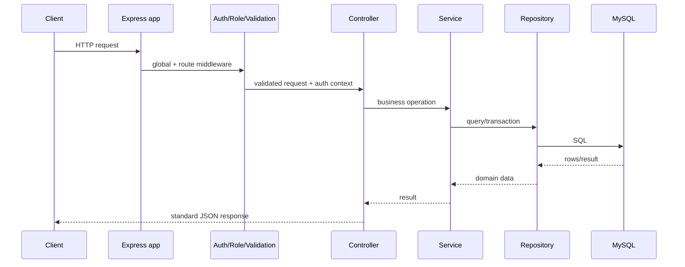
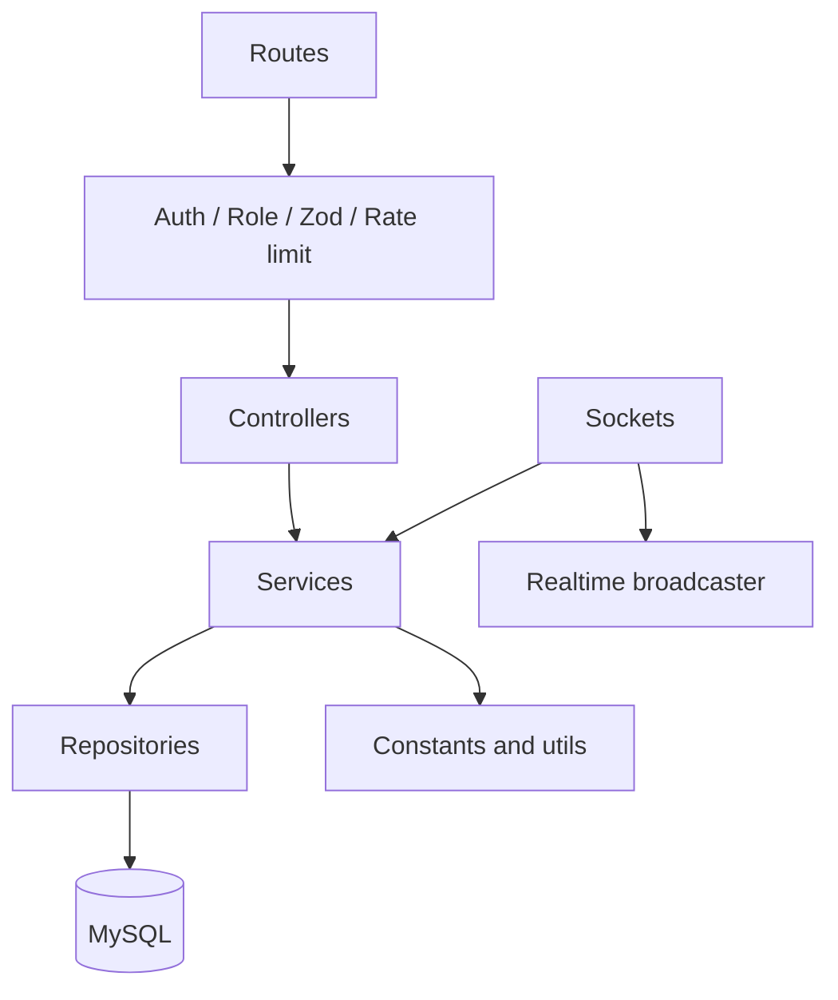
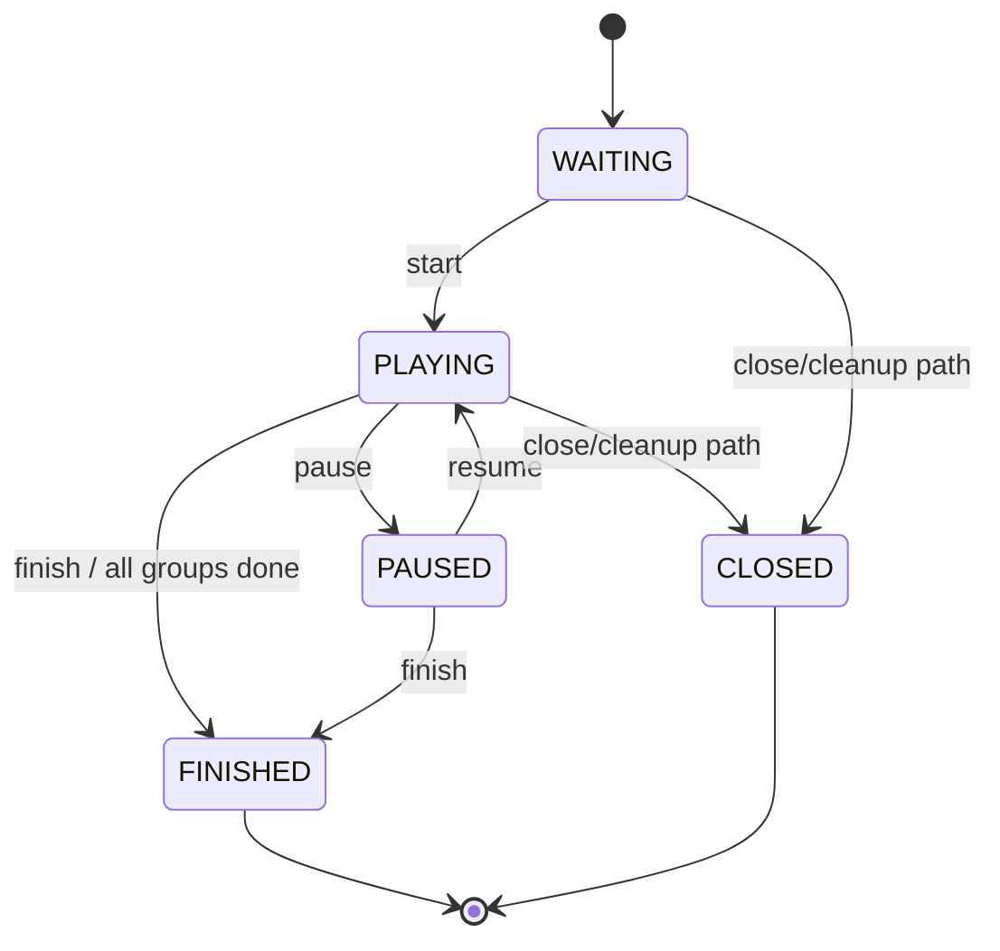
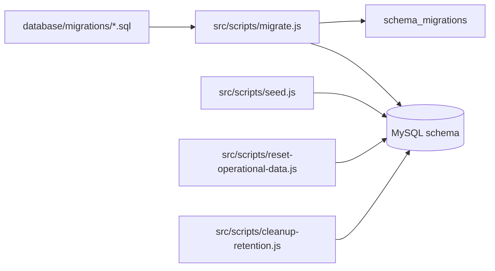

# PhillyoGo Backend Architecture (Current Implementation)

Dokumen ini adalah panduan teknis untuk developer yang perlu memahami, menjalankan, menguji, atau mengembangkan backend PhillyoGo. Isinya mengikuti implementasi aktual di folder `backend/` pada saat dokumen ini dibuat, dengan migration sebagai sumber kebenaran schema.

## 1. Ringkasan Sistem

PhillyoGo adalah backend Node.js untuk permainan edukatif berbasis kelas. Sistem menyediakan:

- autentikasi super admin, admin sekolah, dan guru;
- manajemen sekolah, guru, kelas, siswa, enrollment, serta topik;
- room join untuk siswa menggunakan kode enam karakter;
- game session dengan input problem dari siswa, guru, atau import;
- perfect matching participant-to-problem tanpa self-assignment;
- pembagian group, turn, reveal card, dan penyelesaian permainan;
- REST API untuk operasi administratif dan game control;
- Socket.IO untuk state realtime antara guru dan peserta;
- audit/request monitoring dan retention cleanup.

```mermaid
flowchart LR
    FE[Frontend React/Vite] -->|REST JSON + cookie| API[Express API]
    FE -->|Socket.IO| GAME[/game namespace]
    ADMIN[Super Admin monitor] -->|JWT Socket| MON[/monitor namespace]
    API --> SVC[Services]
    API --> REPO[Repositories]
    GAME --> SVC
    SVC --> DB[(MySQL 8 / InnoDB)]
    API --> LOG[In-memory request log]
    SERVER[server.js] --> API
    SERVER --> GAME
```

## 2. Technology Stack

| Area                | Implementasi                                                                                                    |
| ------------------- | --------------------------------------------------------------------------------------------------------------- |
| Runtime             | Node.js dengan ES modules (`"type": "module"`).                                                                 |
| HTTP                | Express `4.21.1`.                                                                                               |
| Realtime            | Socket.IO `4.8.0`, client test `4.8.3`.                                                                         |
| Database            | MySQL 8, driver `mysql2`, connection pool.                                                                      |
| Authentication      | JWT access token, refresh token hash di database, bcryptjs, httpOnly cookie untuk refresh.                      |
| Validation          | Zod untuk body, params, dan query.                                                                              |
| Security middleware | Helmet, CORS allowlist, cookie-parser.                                                                          |
| File import         | Multer in-memory upload dan XLSX parser untuk workbook Excel.                                                   |
| Utilities           | UUID, dotenv.                                                                                                   |
| Testing             | Node built-in test runner, Supertest, Socket.IO client.                                                         |
| Deployment saat ini | Node + MySQL lokal; opsional Cloudflare Quick Tunnel; frontend dapat di-host terpisah seperti Cloudflare Pages. |

Dependency utama berada di `backend/package.json`. Backend tidak memakai ORM; query dan transaksi ditulis pada repository/service dengan `mysql2`.

## 3. Struktur Folder

```text
backend/
  database/migrations/       SQL migration dan perubahan schema
  scripts/                   REST dan Socket.IO smoke runner
  src/
    app.js                  Express app factory dan middleware global
    server.js               HTTP server, Socket.IO, retention timer
    config/                 env, pool database, socket, realtime reference
    constants/              roles, statuses, game modes, socket events
    controllers/            adapter HTTP: request -> service -> response
    middleware/             auth, role, validation, rate limit, logging, error
    repositories/           query MySQL dan operasi persistence/transaction
    routes/                 route registration dan endpoint middleware
    services/               business rules, lifecycle, matching, import
    sockets/                Socket.IO authentication, handlers, broadcasts
    utils/                  JWT, game state, response, room code, helpers
    validators/             schema Zod per fitur
    scripts/                migrate, seed, reset operational, cleanup
  tests/                    unit, API hardening, dan optional integration test
```

## 4. Bootstrap dan Middleware HTTP

`src/server.js` membuat HTTP server dari `createApp()`, memasang Socket.IO, mendaftarkan handler realtime, menjalankan listener pada `PORT`, lalu menjadwalkan retention cleanup harian dengan timer `unref`.

`src/app.js` memasang middleware dalam urutan berikut:

1. `helmet()` untuk header keamanan.
2. `cors()` dengan allowlist `FRONTEND_URLS` dan `credentials: true`.
3. `express.json()`.
4. `cookieParser()`.
5. `requestLogMiddleware` untuk menyimpan request log secara process-local.
6. `GET /health` yang mengembalikan service `phillyogo-backend` dan status `ok`.
7. Router API di bawah `API_PREFIX`, default yang dipakai deployment adalah `/api/v1`.
8. `errorMiddleware` sebagai handler error terakhir.



## 5. Configuration dan Environment

Environment dibaca dan divalidasi oleh `src/config/env.js`:

| Variable                                                               | Fungsi                             |
| ---------------------------------------------------------------------- | ---------------------------------- |
| `NODE_ENV`                                                             | Mode runtime.                      |
| `PORT`                                                                 | Port HTTP dan Socket.IO.           |
| `API_PREFIX`                                                           | Prefix REST, biasanya `/api/v1`.   |
| `FRONTEND_URL`, `FRONTEND_URLS`                                        | Origin yang diizinkan CORS/socket. |
| `REFRESH_COOKIE_NAME`                                                  | Nama cookie refresh token.         |
| `RETENTION_DAYS`                                                       | Umur data game sebelum cleanup.    |
| `DB_HOST`, `DB_PORT`, `DB_NAME`, `DB_USER`, `DB_PASSWORD`              | Koneksi MySQL.                     |
| `DB_CONNECTION_LIMIT`                                                  | Ukuran pool.                       |
| `JWT_ACCESS_SECRET`, `JWT_ACCESS_EXPIRES_IN`                           | Access JWT.                        |
| `JWT_REFRESH_SECRET`, `JWT_REFRESH_EXPIRES_IN`                         | Refresh JWT.                       |
| `SEED_SUPER_ADMIN_EMAIL`, `SEED_SUPER_ADMIN_PASSWORD`                  | Seed super admin.                  |
| `SEED_SCHOOL_NAME`, `SEED_SCHOOL_DOMAIN`, `SEED_SCHOOL_ADMIN_PASSWORD` | Seed sekolah dan admin.            |

`.env.example` juga mendeklarasikan `ROOM_SESSION_TTL_HOURS`, tetapi implementasi room saat ini memakai expiry hardcoded 24 jam di `controllers/room.controller.js`. Jangan menganggap variable tersebut configurable sampai kode diubah.

## 6. Authentication dan Authorization

### Login flow

1. Client mengirim email dan password ke `POST /auth/login`.
2. `auth.service` mencari user dan memverifikasi password dengan bcryptjs.
3. Backend menerbitkan access JWT dan refresh JWT.
4. Refresh token disimpan sebagai hash pada `refresh_tokens`.
5. Refresh JWT dikirim melalui cookie sesuai `REFRESH_COOKIE_NAME`.
6. Access token dipakai sebagai `Authorization: Bearer <token>`.

### Middleware

- `requireAuth` hanya menerima Bearer JWT yang valid, lalu menaruh user context pada request.
- `allowRoles` membatasi `SUPER_ADMIN`, `ADMIN`, atau `TEACHER`.
- Validasi Zod berjalan di route melalui `validate`.
- Public student routes tidak menggunakan JWT; identitas peserta memakai `x-participant-session-id` dan pengecekan ownership terhadap session.

Role scope utama:

| Role               | Akses                                                                                         |
| ------------------ | --------------------------------------------------------------------------------------------- |
| `SUPER_ADMIN`      | Sekolah, dashboard super admin, request logs.                                                 |
| `ADMIN`            | Guru, kelas, siswa/enrollment, topik, dashboard admin.                                        |
| `TEACHER`          | Kelas yang ditugaskan, room, game session, game control, history, dashboard guru.             |
| Public participant | Join room, register participant, submit problem, baca group/state sesuai participant session. |

## 7. REST API Surface

Semua path berikut berada di bawah `API_PREFIX`, kecuali `/health`.

### Auth

| Method | Path             | Akses          |
| ------ | ---------------- | -------------- |
| POST   | `/auth/login`    | Public         |
| POST   | `/auth/refresh`  | Refresh cookie |
| POST   | `/auth/logout`   | Authenticated  |
| GET    | `/auth/me`       | Authenticated  |
| PATCH  | `/auth/password` | Authenticated  |

### School, class, teacher, topic

| Module         | Endpoint                                                                                                                                                                                                                                                                                |
| -------------- | --------------------------------------------------------------------------------------------------------------------------------------------------------------------------------------------------------------------------------------------------------------------------------------- |
| Schools        | `GET/POST /schools`, `GET /schools/:schoolId`, `PATCH /schools/:schoolId/status`, `DELETE /schools/:schoolId`, `POST /schools/:schoolId/admin/reset-password`                                                                                                                           |
| Classes        | `GET /classes`, `GET /classes/:classId`, `GET /classes/:classId/students`, `POST /classes`, `PATCH /classes/:classId`, `POST /classes/preview-students`, `GET /classes/student-template`, `POST /classes/promote`, `POST /classes/reset-level`, `POST /classes/:classId/students/reset` |
| Class teachers | `POST /classes/:classId/teachers`, `DELETE /classes/:classId/teachers/:teacherId`                                                                                                                                                                                                       |
| Teachers       | `GET /teachers`, `GET /teachers/:teacherId`, `POST /teachers`, `GET /teachers/import/template`, `POST /teachers/import/preview`, `POST /teachers/import`, `POST /teachers/:teacherId/reset-password`                                                                                    |
| Topics         | `GET /topics`, `POST /topics`, `PATCH /topics/:topicId`, `DELETE /topics/:topicId`                                                                                                                                                                                                      |
| Student module | Endpoint tambahan tersedia melalui `student.routes.js` untuk operasi student/enrollment yang dipakai implementation saat ini.                                                                                                                                                           |

### Room dan game session

| Method | Path                                                              | Akses                      |
| ------ | ----------------------------------------------------------------- | -------------------------- |
| POST   | `/classes/:classId/rooms`                                         | Teacher                    |
| POST   | `/classes/:classId/teacher-game-sessions`                         | Teacher                    |
| POST   | `/classes/:classId/game-sessions`                                 | Teacher                    |
| GET    | `/rooms/:roomId`                                                  | Authenticated sesuai scope |
| POST   | `/rooms/:roomId/close`                                            | Teacher                    |
| POST   | `/rooms/:roomId/game-sessions`                                    | Teacher                    |
| GET    | `/game-sessions/:sessionId`                                       | Teacher                    |
| PATCH  | `/game-sessions/:sessionId`                                       | Teacher                    |
| POST   | `/game-sessions/:sessionId/start`                                 | Teacher                    |
| POST   | `/game-sessions/:sessionId/pause`                                 | Teacher                    |
| POST   | `/game-sessions/:sessionId/resume`                                | Teacher                    |
| POST   | `/game-sessions/:sessionId/finish`                                | Teacher                    |
| POST   | `/game-sessions/:sessionId/problems`                              | Teacher                    |
| POST   | `/game-sessions/:sessionId/participants`                          | Teacher                    |
| POST   | `/game-sessions/:sessionId/participants/import/preview`           | Teacher                    |
| POST   | `/game-sessions/:sessionId/participants/import`                   | Teacher                    |
| GET    | `/game-sessions/:sessionId/groups`                                | Teacher                    |
| GET    | `/game-sessions/:sessionId/groups/:groupId/current-turn`          | Teacher                    |
| POST   | `/game-sessions/:sessionId/groups/:groupId/turn/reveal`           | Teacher                    |
| POST   | `/game-sessions/:sessionId/groups/:groupId/turn/complete`         | Teacher                    |
| POST   | `/game-sessions/:sessionId/groups/:groupId/turn/:turnId/reveal`   | Teacher                    |
| POST   | `/game-sessions/:sessionId/groups/:groupId/turn/:turnId/complete` | Teacher                    |
| GET    | `/game-sessions/teacher-input-template`                           | Teacher                    |
| POST   | `/game-sessions/teacher-input-preview`                            | Teacher                    |

### Public participant

| Method | Path                                            | Tujuan                                                     |
| ------ | ----------------------------------------------- | ---------------------------------------------------------- |
| POST   | `/public/rooms/join`                            | Validasi kode dan join room.                               |
| POST   | `/public/game-sessions/:sessionId/participants` | Membuat/memulihkan participant session.                    |
| GET    | `/public/game-sessions/:sessionId/students`     | Membaca daftar student yang tersedia sesuai aturan public. |
| POST   | `/public/game-sessions/:sessionId/problems`     | Submit problem oleh participant.                           |
| GET    | `/public/game-sessions/:sessionId/group`        | Membaca group participant.                                 |
| GET    | `/public/game-sessions/:sessionId/state`        | Membaca state publik yang sudah disanitasi.                |

Header `x-participant-session-id` adalah bagian dari kontrak public participant. Data privat guru atau participant lain tidak boleh dikirim oleh public state serializer.

### History, dashboard, monitoring

- `GET /teacher/history`
- `GET /teacher/game-sessions/:sessionId/history`
- `GET /teacher/classes`
- `GET /teacher/classes/:classId`
- `GET /super-admin/dashboard`
- `GET /admin/dashboard`
- `GET /teacher/dashboard`
- `GET /super-admin/request-logs`

## 8. Layer dan Tanggung Jawab



- **Routes**: menyusun URL, HTTP method, middleware, dan controller handler.
- **Middleware**: cross-cutting concern; tidak seharusnya memuat aturan domain game yang panjang.
- **Controllers**: adapter tipis untuk membaca request, memanggil service, dan mengirim response.
- **Services**: sumber utama business rules, authorization scope tingkat domain, transaction orchestration, import, matching, dan lifecycle.
- **Repositories**: SQL, query composition, row mapping, dan operasi database. Service menentukan kapan transaksi digunakan.
- **Sockets**: autentikasi handshake, join socket room, menerima command client, memanggil service, dan broadcast event.

Mapping service utama:

| Controller/entrypoint | Service utama                      | Repository utama                       |
| --------------------- | ---------------------------------- | -------------------------------------- |
| Auth                  | `auth.service`                     | `user.repository`                      |
| School                | `school.service`                   | `school.repository`, `user.repository` |
| Class/student         | `class.service`, `student.service` | class/student repositories             |
| Teacher               | `teacher.service`                  | teacher/user repositories              |
| Topic                 | `topic.service`                    | topic repository                       |
| Room                  | `room.service`                     | room repository                        |
| Game                  | `game.service`, `room.service`     | game/room repositories                 |
| History               | `history.service`                  | history repository                     |
| Dashboard             | `dashboard.service`                | aggregate repository/service queries   |
| Request log           | request-log service                | in-memory store                        |

Ada beberapa pengecualian legacy: `public.routes.js` melakukan dynamic import repository/service secara langsung, `room.controller.js` melakukan lookup public participant state langsung, dan `game.service.js` memiliki beberapa direct repository import untuk persistence khusus. Saat menambah fitur baru, ikuti pola controller-service-repository kecuali ada alasan kompatibilitas yang jelas.

## 9. Game Flow dan State Machine

### Setup

1. Guru membuat atau membuka room untuk kelas.
2. Session dibuat dengan `input_mode`, `game_mode`, `problem_display_limit`, optional `topic_id`, dan optional `group_count`.
3. Siswa join menggunakan room code dan mendaftarkan participant session.
4. Problem dikumpulkan dari siswa, guru, atau import XLSX.
5. Guru dapat mengubah konfigurasi selama status masih `WAITING`.

### Start transaction

`game.service.startGame` secara konseptual melakukan:

1. lock game session;
2. validasi room masih open jika session memiliki room;
3. validasi status `WAITING`;
4. ambil participant dan problem aktif;
5. tolak jumlah participant/problem yang berbeda;
6. jalankan `matching.service.createPerfectMatching` dengan secure shuffle dan augmenting-path bipartite matching;
7. buat group dan group member;
8. buat assignment participant-to-problem;
9. buat turn, aktifkan turn pertama tiap group;
10. ubah session menjadi `PLAYING`;
11. commit transaction dan broadcast state.

Matching menolak kasus self-assignment dan kasus yang tidak memiliki perfect matching. Constraint `uq_assignment_participant` serta `uq_assignment_problem` menjadi pertahanan database tambahan.

### Transition



Saat turn direveal, teacher command mengubah state card menjadi `REVEALED`. Saat turn selesai, assignment dan turn ditandai completed, turn pending berikutnya diaktifkan, atau group ditandai finished. Jika seluruh group selesai, session menjadi `FINISHED` dan room terkait ditutup.

## 10. Socket.IO Realtime

### Namespace dan authentication

- `/game`: namespace permainan.
  - Teacher mengirim JWT melalui `handshake.auth.token`; hanya role `TEACHER` diterima.
  - Student mengirim `participantSessionId` dan `gameSessionId`; participant diverifikasi dari database.
- `/monitor`: hanya menerima JWT super admin yang valid.

Socket rooms:

- `game:{sessionId}`: seluruh peserta session.
- `teacher-game:{sessionId}`: subscriber guru.
- `group:{groupId}`: anggota group.

### Client commands

`join-game`, `request-state`, `start-game`, `pause-game`, `resume-game`, `finish-game`, `submit-problem`, `reveal-cards`, `complete-turn`.

### Server events

`state-snapshot`, `room-state`, `participant-joined`, `problem-submitted`, `participant-status-changed`, `all-participants-ready`, `your-group-assigned`, `your-session-restored`, `groups-assigned`, `game-started`, `game-paused`, `game-resumed`, `turn-started`, `cards-revealed`, `turn-completed`, `game-finished`, `server-error`.

`/monitor` menerima event `request-log`. Request log dan rate-limit counter bersifat process-local sehingga tidak dibagi antar instance dan hilang saat proses restart.

## 11. Error Handling, Validation, dan Rate Limit

- Route schema dibuat dengan Zod dan dijalankan oleh `validation.middleware.js`.
- Error domain diubah oleh `error.middleware.js` menjadi response JSON yang konsisten.
- `rateLimit.middleware.js` menggunakan counter berbasis IP di memory proses.
- Upload XLSX menggunakan Multer in-memory, umumnya dibatasi 5 MB sebelum diproses oleh service import.
- Public event memakai sanitization agar content atau state privat tidak bocor ke participant lain.
- CORS memakai allowlist, bukan wildcard, dan mengizinkan credentials untuk cookie/socket.

## 12. Database dan Migration Workflow



Perintah:

```powershell
Set-Location E:\Innovation-hub\prototype-1\backend
npm install
npm run db:migrate
npm run db:seed
npm run dev
```

Operational commands:

```powershell
npm run db:cleanup
npm run db:reset-operational -- --yes
```

`reset-operational` menghapus game, room, enrollment, class, student, dan topic data, tetapi mempertahankan schools, users, refresh tokens, audit logs, dan schema. `cleanup-retention` menghapus game session expired beserta turns, assignments, memberships, groups, problems, dan participants terkait; room, student history, dan audit log tidak ikut dihapus.

## 13. Test Strategy

```powershell
npm test
npm run test:socket
npm run test:api
npm run test:api:socket
```

| Test                                | Cakupan                                                                                                 |
| ----------------------------------- | ------------------------------------------------------------------------------------------------------- |
| `foundation.test.js`                | Room code, login validation, class-number coercion.                                                     |
| `matching.test.js`                  | Perfect matching dan impossible matching.                                                               |
| `prd-hardening.test.js`             | Public sanitization, rate limit, transition, socket event contract.                                     |
| `socket.integration.test.js`        | Integrasi socket dengan server nyata; aktif hanya jika `RUN_SOCKET_TEST=1` dan membutuhkan JWT/session. |
| `scripts/api-test-runner.js`        | Smoke/end-to-end REST flow.                                                                             |
| `scripts/socket-api-test-runner.js` | Smoke Socket.IO API.                                                                                    |

Saat mengubah lifecycle game, minimal jalankan test matching, state transition, public sanitization, dan socket contract. Saat mengubah migration, jalankan migration pada database disposable dan cek seluruh foreign key/index.

## 14. Deployment Saat Ini

Deployment yang terdokumentasi adalah:

```text
Frontend / user internet
        |
Cloudflare Quick Tunnel (optional)
        |
Node.js backend + Socket.IO di laptop/server
        |
MySQL lokal
```

Langkah dasar:

1. Isi `.env` dengan DB, JWT secret, CORS origins, dan seed values.
2. Pastikan MySQL berjalan.
3. Jalankan `npm run db:migrate`.
4. Seed hanya pada database baru dengan `npm run db:seed`.
5. Jalankan `npm start`.
6. Cek `GET http://localhost:3000/health`.
7. Untuk demo internet, jalankan `cloudflared tunnel --url http://localhost:3000`.
8. Set frontend `VITE_API_URL` ke `/api/v1` dan `VITE_SOCKET_URL` ke backend host.

Quick Tunnel cocok untuk development/demo, bukan deployment produksi permanen. Laptop, MySQL, backend, dan tunnel harus tetap aktif. Jangan commit `.env`, password, atau JWT secret.

## 15. Known Gaps dan Risiko Implementasi

Bagian ini sengaja mendokumentasikan kondisi aktual agar developer tidak membuat asumsi yang salah.

1. `ROOM_SESSION_TTL_HOURS` tersedia di contoh environment tetapi belum dibaca; expiry room/session dibuat 24 jam secara hardcoded.
2. `room.socket.js` berisi handler, tetapi saat ini belum diregistrasikan oleh `sockets/index.js`.
3. Request log dan rate limiter hanya berada di memory proses; tidak cocok untuk multi-instance tanpa shared store.
4. Beberapa nama route di README backend sudah stale. Implementasi saat ini memakai `PATCH /game-sessions/:sessionId`, `/problems`, dan `/participants` pada scope game session.
5. Dua bentuk URL reveal/complete turn aktif: bentuk body `.../turn/reveal|complete` dan bentuk path `.../turn/:turnId/reveal|complete`. Validasi keduanya tidak identik.
6. Migration 002 destructive dan tidak boleh diperlakukan sebagai migration production non-destructive biasa.
7. `game_sessions.class_id` dan `state_version` memiliki defensive handling historis di migration runner yang menunjukkan schema drift masa lalu.
8. Socket integration test mengharapkan snapshot berstatus `PLAYING`, sehingga tidak cocok sebagai smoke test untuk semua valid session state.
9. `groups.active_turn_id` belum memiliki FK database eksplisit ke `game_turns.id`; integritasnya dijaga oleh application flow. `groups.leader_participant_id` memiliki FK ke participant dan diperbarui saat leader disconnect.
10. `participants.student_id` nullable; unique composite dengan nilai NULL mengikuti perilaku MySQL dan tidak mencegah banyak participant anonim pada session yang sama.
11. Pada mode `GROUPS`, matching dilakukan per group, reveal dan complete turn diotorisasi hanya untuk leader aktif, dan leader berikutnya otomatis dipilih saat leader disconnect.

## 16. Panduan Perubahan untuk Developer

Untuk endpoint baru:

1. Tambahkan validator Zod.
2. Tambahkan repository query bila perlu.
3. Letakkan business rule di service.
4. Tambahkan controller tipis.
5. Daftarkan route dengan auth/role/validation yang tepat.
6. Tambahkan test behavior dan update daftar endpoint.

Untuk perubahan database:

1. Buat migration baru, jangan mengedit migration yang sudah pernah dijalankan.
2. Pertimbangkan backward compatibility dengan data existing.
3. Tambahkan/ubah ERD `DATABASE_ERD.md` dan `DATABASE_ERD.drawio`.
4. Jalankan migration pada database disposable.
5. Uji insert, update, delete, foreign key, unique key, dan retention path.

Untuk perubahan game/realtime:

1. Periksa state transition dan transaction boundary.
2. Pastikan public state tetap tersanitasi.
3. Update constant event, socket handler, dan client contract secara konsisten.
4. Uji REST command dan socket command karena keduanya dapat mengubah state yang sama.
