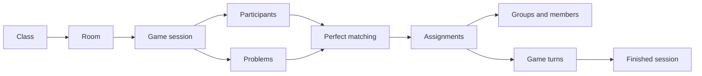

# PhillyoGo Database ERD

Dokumen ini menggambarkan schema database yang berjalan saat ini berdasarkan seluruh migration di `backend/database/migrations/`, dari `001_initial_schema.sql` sampai `006_allow_class_identity_across_years.sql`.

## Sumber Kebenaran

- Database engine: MySQL 8 dengan InnoDB.
- Urutan migration: lexicographic order, dicatat pada tabel `schema_migrations` oleh `src/scripts/migrate.js`.
- ERD ini memprioritaskan schema yang benar-benar dibuat oleh migration, bukan schema yang hanya tertulis di PRD atau README.
- Migration `002_student_enrollment_model.sql` bersifat destructive: sebelum mengubah model enrollment, migration menghapus data operasional serta user `ADMIN` dan `TEACHER`.
- Migration `003_class_uniqueness.sql` tidak mengubah schema karena hanya menjalankan `SELECT 1`.

## ERD Mermaid

```mermaid
erDiagram
    SCHOOLS {
        BIGINT id PK
        VARCHAR name
        ENUM level
        VARCHAR slug UK
        VARCHAR domain UK
        ENUM status
        DATETIME created_at
        DATETIME updated_at
    }
    USERS {
        BIGINT id PK
        BIGINT school_id FK
        ENUM role
        VARCHAR full_name
        CHAR nip UK
        VARCHAR email UK
        VARCHAR password_hash
        ENUM status
        BIGINT admin_school_id UK_GENERATED
        DATETIME last_login_at
        DATETIME created_at
        DATETIME updated_at
    }
    CLASSES {
        BIGINT id PK
        BIGINT school_id FK
        VARCHAR academic_year
        VARCHAR grade_level
        VARCHAR major
        INT class_number
        VARCHAR name
        ENUM status
        DATETIME created_at
        DATETIME updated_at
    }
    TEACHER_CLASSES {
        BIGINT id PK
        BIGINT teacher_id FK
        BIGINT class_id FK
        DATETIME assigned_at
        DATETIME unassigned_at
    }
    TOPICS {
        BIGINT id PK
        BIGINT school_id FK
        BIGINT created_by FK
        ENUM visibility
        VARCHAR title
        TEXT description
        ENUM status
        DATETIME created_at
        DATETIME updated_at
    }
    ROOMS {
        BIGINT id PK
        BIGINT class_id FK
        BIGINT created_by FK
        CHAR code UK
        ENUM status
        DATETIME opened_at
        DATETIME closed_at
        DATETIME created_at
    }
    GAME_SESSIONS {
        BIGINT id PK
        BIGINT room_id FK
        BIGINT class_id FK
        BIGINT created_by FK
        BIGINT topic_id FK
        ENUM input_mode
        ENUM game_mode
        INT problem_display_limit
        INT group_count
        ENUM status
        INT state_version
        DATETIME expires_at
        DATETIME started_at
        DATETIME paused_at
        DATETIME resumed_at
        DATETIME finished_at
        DATETIME created_at
        DATETIME updated_at
    }
    STUDENTS {
        BIGINT id PK
        CHAR nisn UK
        VARCHAR full_name
        DATETIME created_at
        DATETIME updated_at
    }
    CLASS_ENROLLMENTS {
        BIGINT id PK
        BIGINT student_id FK
        BIGINT class_id FK
        BIGINT school_id FK
        VARCHAR academic_year
        ENUM status
        VARCHAR active_student_year UK_GENERATED
        DATETIME created_at
        DATETIME updated_at
    }
    STUDENT_PROBLEMS {
        BIGINT id PK
        BIGINT student_id FK
        BIGINT game_session_id FK
        BIGINT class_id FK
        TEXT content
        DATETIME created_at
    }
    PARTICIPANTS {
        BIGINT id PK
        BIGINT game_session_id FK
        BIGINT student_id FK
        CHAR session_uuid UK
        VARCHAR full_name
        ENUM status
        DATETIME joined_at
        DATETIME connected_at
        DATETIME disconnected_at
        DATETIME finished_at
        DATETIME created_at
        DATETIME updated_at
    }
    PROBLEMS {
        BIGINT id PK
        BIGINT game_session_id FK
        BIGINT participant_id FK
        BIGINT created_by FK
        TEXT content
        ENUM source
        ENUM status
        DATETIME submitted_at
        DATETIME created_at
    }
    GROUPS {
        BIGINT id PK
        BIGINT game_session_id FK
        BIGINT leader_participant_id FK
        INT group_number
        ENUM status
        BIGINT active_turn_id FK_LOGICAL
        DATETIME created_at
        DATETIME updated_at
    }
    GROUP_MEMBERS {
        BIGINT id PK
        BIGINT group_id FK
        BIGINT participant_id FK
        DATETIME assigned_at
    }
    ASSIGNMENTS {
        BIGINT id PK
        BIGINT game_session_id FK
        BIGINT group_id FK
        BIGINT participant_id FK
        BIGINT problem_id FK
        INT sequence_number
        ENUM status
        DATETIME assigned_at
        DATETIME completed_at
    }
    GAME_TURNS {
        BIGINT id PK
        BIGINT game_session_id FK
        BIGINT group_id FK
        BIGINT assignment_id FK
        INT turn_number
        ENUM status
        ENUM participant_card_state
        ENUM problem_card_state
        DATETIME started_at
        DATETIME revealed_at
        DATETIME completed_at
        DATETIME created_at
    }
    REFRESH_TOKENS {
        BIGINT id PK
        BIGINT user_id FK
        VARCHAR token_hash
        DATETIME expires_at
        DATETIME revoked_at
        DATETIME created_at
    }
    AUDIT_LOGS {
        BIGINT id PK
        BIGINT actor_user_id FK
        BIGINT school_id FK
        VARCHAR action
        VARCHAR entity_type
        BIGINT entity_id
        JSON metadata
        DATETIME created_at
    }

    SCHOOLS ||--o{ USERS : owns
    SCHOOLS ||--o{ CLASSES : contains
    SCHOOLS ||--o{ TOPICS : scopes
    SCHOOLS ||--o{ CLASS_ENROLLMENTS : records
    SCHOOLS ||--o{ AUDIT_LOGS : scopes
    USERS ||--o{ TEACHER_CLASSES : assigned
    CLASSES ||--o{ TEACHER_CLASSES : receives
    USERS ||--o{ TOPICS : creates
    CLASSES ||--o{ ROOMS : hosts
    USERS ||--o{ ROOMS : creates
    ROOMS ||--o{ GAME_SESSIONS : contains
    CLASSES ||--o{ GAME_SESSIONS : contextualizes
    USERS ||--o{ GAME_SESSIONS : creates
    TOPICS ||--o{ GAME_SESSIONS : uses
    STUDENTS ||--o{ CLASS_ENROLLMENTS : enrolls
    CLASSES ||--o{ CLASS_ENROLLMENTS : has
    SCHOOLS ||--o{ STUDENT_PROBLEMS : scopes
    STUDENTS ||--o{ STUDENT_PROBLEMS : writes
    CLASSES ||--o{ STUDENT_PROBLEMS : contextualizes
    GAME_SESSIONS ||--o{ STUDENT_PROBLEMS : receives
    STUDENTS ||--o{ PARTICIPANTS : identifies
    GAME_SESSIONS ||--o{ PARTICIPANTS : admits
    GAME_SESSIONS ||--o{ PROBLEMS : collects
    PARTICIPANTS o|--o{ PROBLEMS : submits
    USERS o|--o{ PROBLEMS : creates
    GAME_SESSIONS ||--o{ GROUPS : creates
    GROUPS ||--o{ GROUP_MEMBERS : contains
    PARTICIPANTS ||--o{ GROUP_MEMBERS : joins
    GAME_SESSIONS ||--o{ ASSIGNMENTS : owns
    GROUPS o|--o{ ASSIGNMENTS : schedules
    PARTICIPANTS ||--o{ ASSIGNMENTS : receives
    PROBLEMS ||--o{ ASSIGNMENTS : provides
    GAME_SESSIONS ||--o{ GAME_TURNS : owns
    GROUPS ||--o{ GAME_TURNS : runs
    ASSIGNMENTS ||--o{ GAME_TURNS : becomes
    USERS ||--o{ REFRESH_TOKENS : owns
    USERS o|--o{ AUDIT_LOGS : acts
```

> `groups.active_turn_id` didefinisikan sebagai kolom referensi logis pada migration awal, tetapi tidak memiliki foreign key constraint eksplisit ke `game_turns.id`. Relasi tersebut sengaja ditandai `FK_LOGICAL`.

## Entitas dan Aturan Integritas

| Tabel               | Tanggung jawab                       | Constraint penting                                                                                                                                                                                     |
| ------------------- | ------------------------------------ | ------------------------------------------------------------------------------------------------------------------------------------------------------------------------------------------------------ |
| `schools`           | Tenant sekolah                       | `slug` dan `domain` unik; `domain` nullable setelah migration 002; `level` adalah `SMP`, `SMA`, atau `SMK`.                                                                                            |
| `users`             | Super admin, admin sekolah, dan guru | Email unik; NIP wajib 18 digit dan unik global untuk guru; super admin tidak boleh punya sekolah; admin/guru wajib punya sekolah; generated `admin_school_id` memastikan satu admin aktif per sekolah. |
| `classes`           | Kelas akademik                       | Identitas unik per `school_id + academic_year + grade_level + major + class_number`; migration 006 menghapus unique key lama yang tidak mempertimbangkan tahun.                                        |
| `teacher_classes`   | Assignment guru ke kelas             | Kombinasi guru-kelas unik; `unassigned_at` menyimpan akhir assignment secara soft-state.                                                                                                               |
| `topics`            | Topik kasus                          | Scope sekolah dan visibility `SCHOOL`/`PRIVATE`; creator adalah user.                                                                                                                                  |
| `rooms`             | Ruang join siswa                     | Kode 6 karakter unik; status `OPEN` atau `CLOSED`.                                                                                                                                                     |
| `game_sessions`     | Konfigurasi dan lifecycle permainan  | Status `WAITING`, `PLAYING`, `PAUSED`, `FINISHED`, `CLOSED`; indeks retention pada `status + expires_at`.                                                                                              |
| `students`          | Master data siswa                    | NISN 10 karakter unik.                                                                                                                                                                                 |
| `class_enrollments` | Riwayat siswa dalam kelas/tahun      | Kombinasi siswa-kelas-tahun unik; generated `active_student_year` memastikan satu enrollment aktif per siswa per tahun akademik.                                                                       |
| `participants`      | Identitas siswa di satu sesi         | `session_uuid` unik; `student_id` nullable untuk peserta anonim; `(game_session_id, student_id)` unik, dan NULL dapat berulang di MySQL.                                                               |
| `problems`          | Kartu masalah                        | Satu problem peserta per sesi melalui `(game_session_id, participant_id)`; participant/creator nullable untuk mendukung sumber teacher/import.                                                         |
| `groups`            | Kelompok permainan                   | Nomor kelompok unik dalam sesi; `leader_participant_id` menunjuk ketua aktif group.                                                                                                                    |
| `group_members`     | Keanggotaan kelompok                 | Peserta tidak boleh terdaftar dua kali pada kelompok yang sama.                                                                                                                                        |
| `assignments`       | Hasil matching peserta-problem       | Satu peserta dan satu problem hanya boleh muncul sekali dalam sesi.                                                                                                                                    |
| `game_turns`        | Urutan reveal dan completion         | Nomor turn dan assignment unik dalam satu kelompok; dua card state disimpan terpisah.                                                                                                                  |
| `refresh_tokens`    | Refresh session autentikasi          | Token disimpan sebagai hash; indeks lookup berdasarkan user, revoked state, dan expiry.                                                                                                                |
| `audit_logs`        | Jejak aktivitas                      | Actor dan school nullable untuk operasi sistem atau data yang telah dihapus; metadata JSON.                                                                                                            |

## Lifecycle Relasional Permainan



Pada saat game dimulai, service mengunci session dalam transaksi, memuat participant dan problem aktif, menolak jumlah yang tidak sama, lalu membuat assignment non-self melalui perfect matching. Setelah itu dibuat group, membership, dan turn. Constraint database menjaga agar participant atau problem tidak mendapat assignment ganda dalam satu session.

Untuk mode `GROUPS`, participant dibagi lebih dahulu dan matching dijalankan terpisah di setiap group. Problem hanya boleh dipasangkan dengan participant dari group yang sama. Setiap group harus memiliki minimal dua participant. Ketua awal dipilih oleh sistem dari participant pertama yang dimasukkan ke group; jika ketua disconnect, participant aktif berikutnya otomatis mengambil alih.

## Catatan Migration

1. Migration diterapkan sekali dan dicatat di `schema_migrations`.
2. Migration 002 membersihkan operational data dan user admin/guru sebelum menambahkan model siswa.
3. Migration 005 menonaktifkan duplikat enrollment aktif terlebih dahulu, lalu menambahkan generated column dan unique index.
4. Migration 006 menghapus `uq_class_identity` dari migration awal karena identitas kelas boleh sama pada tahun akademik berbeda.
5. Migration 007 menghapus seluruh data guru lama beserta assignment kelasnya sebelum menambahkan NIP global unik pada tabel `users`.
6. Migration 008 menambahkan `groups.leader_participant_id` untuk otoritas turn dan pergantian ketua realtime.
7. Migration 009 mengisi ketua untuk group lama yang sudah ada berdasarkan anggota aktif/urutan assignment.
8. Script migration memiliki defensive/idempotent handling untuk beberapa perubahan historis, termasuk `game_sessions.class_id` dan `state_version`; dokumentasi ini tetap merepresentasikan hasil schema final.

## Cara Menggunakan

- Preview Mermaid di GitHub, VS Code Markdown preview, atau Mermaid Live Editor.
- Buka `DATABASE_ERD.drawio` di diagrams.net untuk mengubah posisi, warna, dan relasi secara visual.
- Setelah perubahan schema, update migration dan kedua artefak ERD secara bersamaan.
